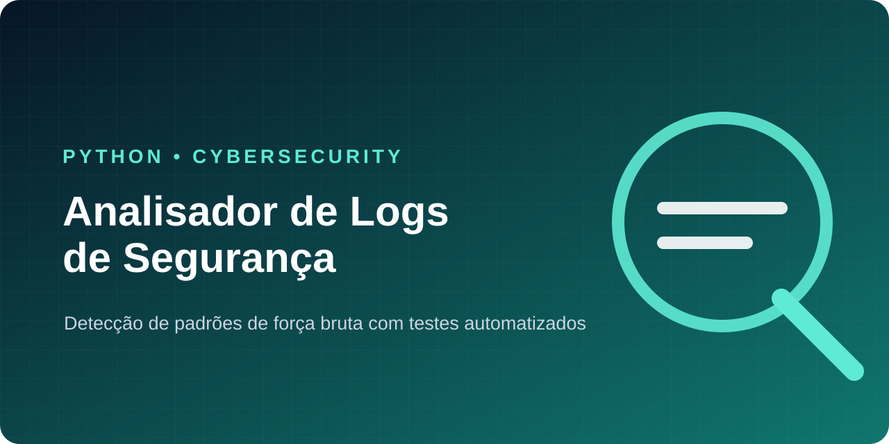

<div align="center">

# Analisador de Logs de Segurança


</div>

Projeto em Python que lê registros de autenticação e identifica padrões compatíveis com tentativas de força bruta.

## O que o projeto demonstra

- leitura e validação de arquivos de log;
- contagem de autenticações com sucesso e falha;
- agrupamento de falhas por endereço IP;
- detecção de três falhas em uma janela de 60 segundos;
- tratamento de linhas e datas inválidas;
- testes automatizados com `unittest`.

## Como executar

```bash
python analisador.py
```

## Como testar

```bash
python -m unittest -v
```

## Formato dos registros

```text
AAAA-MM-DD HH:MM:SS | ENDEREÇO_IP | EVENTO | USUÁRIO
```

Eventos reconhecidos: `LOGIN_SUCESSO` e `LOGIN_FALHA`.

> Todos os nomes, horários e endereços IP deste projeto são fictícios e destinados exclusivamente a estudo.

## Tecnologias e conceitos

Python · pathlib · datetime · arquivos · listas · dicionários · tratamento de exceções · testes automatizados · análise de eventos de segurança

---

Desenvolvido por [Nicolas Marques](https://github.com/NicolasMarquesSousa) · [Ver portfólio](https://github.com/NicolasMarquesSousa)
